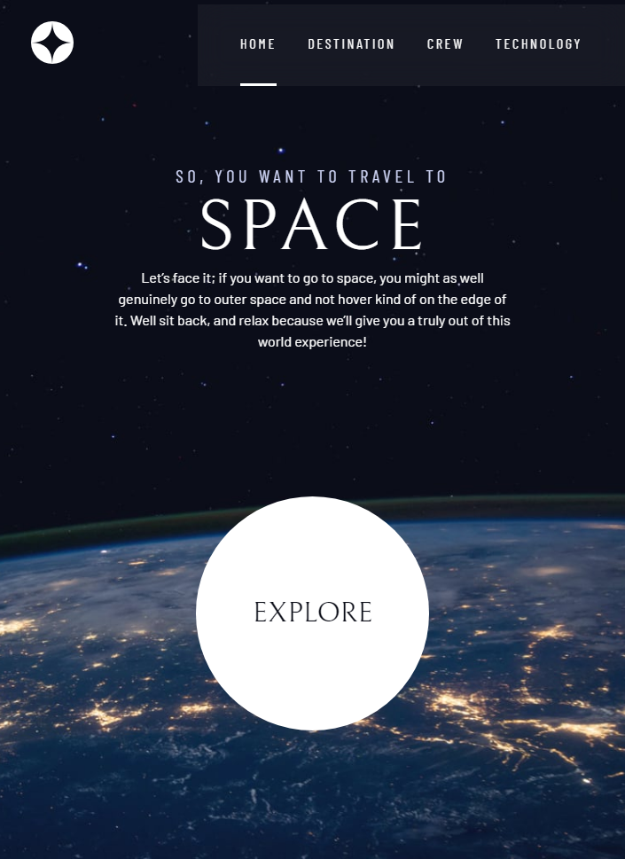

# Frontend Mentor - Space tourism website solution

This is a solution to the [Space tourism website challenge on Frontend Mentor](https://www.frontendmentor.io/challenges/space-tourism-multipage-website-gRWj1URZ3). Frontend Mentor challenges help you improve your coding skills by building realistic projects.

## Table of contents

- [Overview](#overview)
  - [The challenge](#the-challenge)
  - [Screenshots](#screenshot)
  - [Links](#links)
- [My process](#my-process)
  - [Built with](#built-with)
  - [What I learned](#what-i-learned)
  - [Continued development](#continued-development)
  - [Useful resources](#useful-resources)
- [Author](#author)
- [Acknowledgments](#acknowledgments)
<p>&nbsp;</p>

## Overview

### The challenge

Users should be able to:

- View the optimal layout for each of the website's pages depending on their device's screen size
- See hover states for all interactive elements on the page
- View each page and be able to toggle between the tabs to see new information
<p>&nbsp;</p>

### Screenshots

<p>&nbsp;</p>
<p>&nbsp;</p>


### Links

- Solution URL: [https://github.com/Kinzume/space-tourism-website-main](https://github.com/Kinzume/space-tourism-website-main)
- Live Site URL: [https://kinzume.github.io/space-tourism-website-main/](https://kinzume.github.io/space-tourism-website-main/)

## My process

### Built with

- Semantic HTML5 markup
- CSS custom properties
- Flexbox
- CSS Grid
- Mobile-first workflow
- JavaScript (ES6)

### What I learned

- CSS selectors

  ```css
  .primary-navigation.underline-indicators {
  	...;
  }
  ```

  - This selects an HTML element which has both classes `primary-navigation` and `underline-indicators`<p>&nbsp;</p>

  ```css
  #primary-navigation.underline-indicators {
  	...;
  }
  ```

  -This selects an HTML element which has the id `primary-navigation` and the class `underline-indicators`<p>&nbsp;</p>

- Feature queries

  ```css
  @supports (backdrop-filter: blur(1rem)) {
  	.primary-navigation {
  		...;
  	}
  }
  ```

  - If the browser supports the `backdrop-filter` property (and supports `blur` with the value `1rem`), then the styles are applied to the markup. In the example above styles for the class `primary-navigation` will be applied.
  <p>&nbsp;</p>

- Flexbox

  - `flex-grow` specifies how much space a flex item takes up in a flex container. If all flex items in the container have the same flex growth factor, then the items will be evenly distributed along the container
  - `flex-basis` works in a similar way to `flex-grow`
  - `order` specifies the position which the flex (or grid) item takes in the container
  <p>&nbsp;</p>

- CSS Grid

  - `place-items` is a shorthand property for `align-items` and `justify-items`. For example, setting `place-items` to `center` will set both `align-items` and `justify-items` to `center`
  - `place-content` is a shorthand property for `align-content` and `justify-content`
  - `display: inline-grid` enables a container to have a grid layout which is treated as an inline element. The container will not expand to fit it's own section
  - `grid-column` is shorthand for `grid-column-start` and `grid-column-end`. This specifies where a grid item should start from
  <p>&nbsp;</p>

- Local undefined custom properties

  - Used as placeholder custom properties which can be specified later on in the markup
  - A fallback property is used until the placeholder is specified
  - Example:

    ```css
    .flex {
    	display: flex;
    	gap: var(--gap, 1rem);
    }
    ```

    - Here, `--gap` would be the placeholder property

<p>&nbsp;</p>

- ARIA

  - ARIA stands for Accessible Rich Internet Applications
  - The following CSS class visually hides content whilst allowing screen readers access to the hidden content. Users can also tab onto the content
    ```css
    .sr-only {
    	/*'screen-reader only'*/
    	/*This hides the element*/
    	position: absolute;
    	width: 1px;
    	height: 1px;
    	padding: 0;
    	margin: -1px;
    	overflow: hidden;
    	clip: rect(0, 0, 0, 0);
    	white-space: nowrap;
    	border: 0;
    }
    ```
  - More info can be found here: https://gomakethings.com/hidden-content-for-better-a11y/#hiding-the-link
  <p>&nbsp;</p>

- WAI-ARIA roles

  - WAI stands for Web Accessibility Initiative
  - `role="role type"` are used to help screen readers identify non-semantic HTML elements
  - For example the screen reader will read the element `<div role="tablist"></div>` as "Tab list"
  - The role attribute can be used with JavaScript to build interactive elements on the page. In this project JavaScript is used to build tab components, which the user can select, to display various content on the page
  - Check out https://developer.mozilla.org/en-US/docs/Web/Accessibility/ARIA/Roles for a list of valid `"role type"` values
  <p>&nbsp;</p>

- `::before` and `::after`

  - Used for decoration
  - In this project I used `::after` to add numbers to the numbered tabs on the [technology page](https://kinzume.github.io/space-tourism-website-main/technology.html). This ensures screen readers won't read the numbers and will only read the meaning of each tab (launch vehicle, spaceport and space capsule)
  <p>&nbsp;</p>

- Semantic HTML

  - Multiple `<header>` tags can be used in the `<body>` of an HTML markup (except within `<footer>`, `<address>` or another `<header>` tag)
  - Example:

        <header>
          <h2>Heading!</h2>
          <p>
          Sub-heading!!
          (Don’t use h3 as lower level h* elements are for
          sub-categories and not sub-titles)`
          </p>
        </header>

    <p>&nbsp;</p>

- `<picture>` elements look something like this

  ```html
  <picture>
  	<source srcset="./assets/destination/image-moon.webp" type="image/webp" />
  	
  </picture>
  ```

  - The browser checks if `<source/>` can be displayed. If not then the `` element is displayed instead (this is the fallback element)
  <p>&nbsp;</p>

### Continued development

I'll be learning how to use SASS to better organise my CSS! I might use this project as an exercise to refactor the CSS into SASS.

<p>&nbsp;</p>

### Useful resources

- [Kevin Powell's Scrimba Course](https://scrimba.com/learn/spacetravel) - This was an invaluable resource that helped me to complete this project.
<p>&nbsp;</p>

## Author

- GitHub - [Kinzume](https://github.com/Kinzume)
- Frontend Mentor - [@Kinzume](https://www.frontendmentor.io/profile/Kinzume)
<p>&nbsp;</p>

## Acknowledgments

A huge thanks to Kevin Powell and Scrimba for creating the course.

- YouTube - [Kevin Powell](https://www.youtube.com/kepowob)
- Scrima - [Scrimba](https://scrimba.com/)
  <p>&nbsp;</p>

### Update 04/06/2022:

Thanks to Danilo Blas [@Sdann26](https://www.frontendmentor.io/profile/Sdann26) for suggesting to learn SASS.

Check out the resources I used:

- YouTube - [The Net Ninja](https://www.youtube.com/playlist?list=PL4cUxeGkcC9jxJX7vojNVK-o8ubDZEcNb)
- YouTube - [Jessica Chan (Coder Coder)](https://www.youtube.com/watch?v=jfMHA8SqUL4)

Please note that `@import` is being depracated and will be replaced with `@use` and `@forward`. If you would like to learn more check out this video from Jessica [Sass @import is being replaced with @use and @forward](https://www.youtube.com/watch?v=dOnYNEXv9BM)
